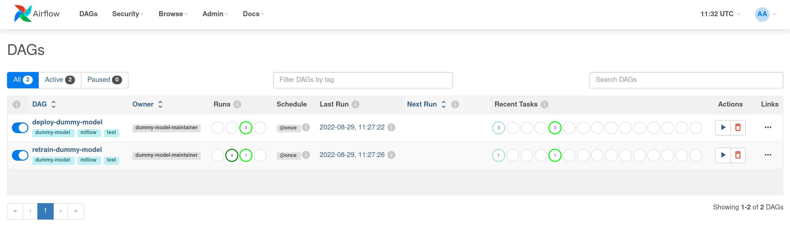
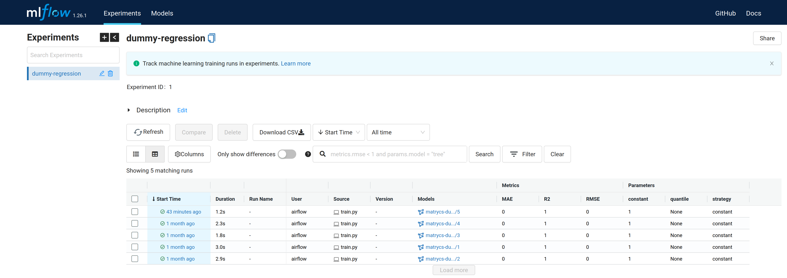
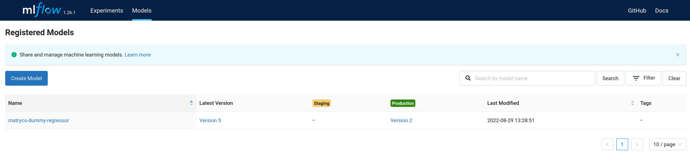

# Example of an MLOps pipeline with Apache Airflow and MLFlow

The repository contains a minimalistic example of the MLOps pipeline used by [MATRYCS](https://matrycs.eu/) project partners. Its purpose is to help partners integrate MLOps practices into their existing ML pipelines of (re)training and deployment of the models. The following significant services are used:

- MLFlow ([GitHub](https://github.com/mlflow/mlflow), [www](https://mlflow.org/), [docs](https://mlflow.org/docs/latest/index.html))
- Apache Airflow ([GitHub](https://github.com/apache/airflow), [www](https://airflow.apache.org/), [docs](https://airflow.apache.org/docs/))
- BentoML ([GitHub](https://github.com/bentoml/BentoML), [www](https://www.bentoml.com/), [docs](https://docs.bentoml.org/en/latest/))

## Quickstart (local deployment)

1. Make sure that Docker and docker-compose are installed.

2. Clone THIS **and** complementary [MATRYCS/ ml_model_tracking_framework](https://github.com/MATRYCS/ml_model_tracking_framework) repository.

3. Start two docker-compose clusters of services:
    - Start MLFlow service from `ml_model_tracking_framework` according to its *README.md* file.
    - Start **THIS** project with `make images` (only first-time) and  `docker-compose up` to bring up the services.

4. Access services:
    - MLFlow on [localhost:5000](http://127.0.0.1:5000)
    - Apache Airflow on [localhost:8080](http://127.0.0.1:8080)

## The Pipeline

The example in the repository is meant for [MATRYCS](https://matrycs.eu/) project partners. Its purpose is to help partners integrate MLOps practices into their existing ML pipelines of (re)training and deployment of the models.

As presented in the Figure above, the demo consists of two separate pipelines. The first pipeline/DAG (*i.e.* `retrain-dummy-model`) is responsible for retraining the machine learning model. The source code of the DAG is located in [dags/retrain_dummy_model.py](./dags/retrain_dummy_model.py). The retraining DAG expects a GitHub repository with the latest working machine learning model to prepare its dependencies and retrain the model according to the `train.py` script. In addition, the `train.py` script is responsible for correctly logging and pushing the binary of built model(s) to the MLFlow service. The example code is located within [MATRYCS/dummy-regression-model](https://github.com/MATRYCS/dummy-regression-model) demo model repository.

The second pipeline/DAG (*i.e.* `deploy-dummy-model`) is responsible for model deployment. The source code of the DAG is located in [dags/deploy_dummy_model.py](./dags/deploy_dummy_model.py). The deployment DAG expects MLFlow service to contain logs of a particular model, where one of the models is marked as `Production` (see figures above). The final stage of DAG wraps produced model into *"bentos"*, which can be forwarded to [BentoML](https://github.com/bentoml/BentoML) serving infrastructure.
